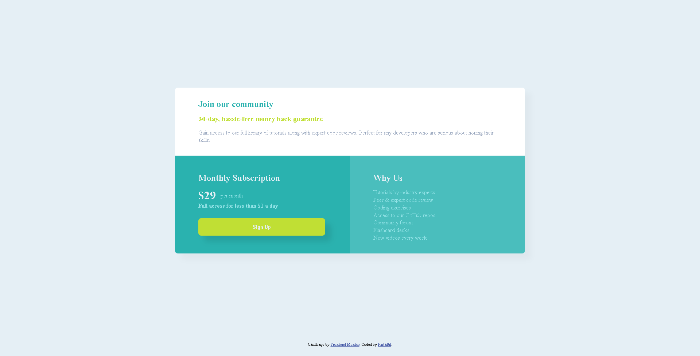

# Frontend Mentor - Single price grid component solution

This is a solution to the [Single price grid component challenge on Frontend Mentor](https://www.frontendmentor.io/challenges/single-price-grid-component-5ce41129d0ff452fec5abbbc). Frontend Mentor challenges help you improve your coding skills by building realistic projects. 

## Table of contents

- [Overview](#overview)
  - [The challenge](#the-challenge)
  - [Screenshot](#screenshot)
  - [Links](#links)
  - [Built with](#built-with)
  - [What I learned](#what-i-learned)
- [Author](#author)

## Overview

### The challenge

Users should be able to:

- View the optimal layout for the component depending on their device's screen size

### Screenshot


### Links

- Solution URL: (https://github.com/chinatukachinonsofaithful/single-price-grid-component)
- Live Site URL: (https://chinatukachinonsofaithful.github.io/single-price-grid-component/)

## My process

### Built with

- Semantic HTML5 markup
- CSS custom properties
- Flexbox
- CSS Grid
- Mobile-first workflow
- Utlity Classes

### What I learned

During this Project, i understood the importance of writing utility classes
  It save's you from Repeating same stlying over and over

But note this, while writing utility classes, use words that depites it's function E.g

```css
.bg-green{
  background: green;
}

.py-2{
  padding-top: 2rem;
  padding-bottom: 2rem;
}

.mx-1{
  margin-right: 1rem;
  margin-left: 1rem;
}

```


## Author

- Website - [chinatukachinonsofaithful](https://github.com/chinatukachinonsofaithful)
- Frontend Mentor - [@chinatukachinonsofaithfu](https://www.frontendmentor.io/profile/chinatukachinonsofaithful)
- Twitter - [@Chinatukachino](https://x.com/Chinatukachino)
